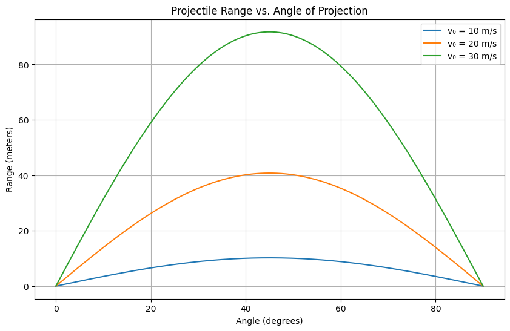

# Problem 1
Projectile motion, while seemingly simple, offers a rich playground for exploring fundamental principles of physics. The problem is straightforward: analyze how the range of a projectile depends on its angle of projection. Yet, beneath this simplicity lies a complex and versatile framework. The equations governing projectile motion involve both linear and quadratic relationships, making them accessible yet deeply insightful.

What makes this topic particularly compelling is the number of free parameters involved in these equations, such as initial velocity, gravitational acceleration, and launch height. These parameters give rise to a diverse set of solutions that can describe a wide array of real-world phenomena, from the arc of a soccer ball to the trajectory of a rocket.

## 1. Theoretical Foundation

### Governing Equations of Motion

Starting from Newton's second law:

##  Vertical Motion

From **Newton's Second Law**:

$$
F = m \cdot a
$$

Gravity is the only force acting, pulling the object downward:

$$
F = -mg
$$

Since acceleration is the second derivative of position with respect to time:

$$
a = \frac{d^2y}{dt^2}
$$

So we get the differential equation:

$$
\frac{d^2y}{dt^2} = -g
$$

### 🔁 Solving Step-by-Step

1. **First integration** — gives us the vertical velocity as a function of time:

$$
\frac{dy}{dt} = -gt + C_1
$$

Where:
- $g$ is the gravitational acceleration ($9.81 \, \text{m/s}^2$)
- $C_1$ is a constant of integration, representing the **initial vertical velocity**, $v_{0y}$

So:

$$
\frac{dy}{dt} = -gt + v_0 \sin(\theta)
$$

2. **Second integration** — gives us vertical position as a function of time:

$$
y(t) = -\frac{1}{2}gt^2 + C_1t + C_2
$$

Where:
- $C_2$ is the **initial height** $y_0$
- Substituting known values:

$$
y(t) = -\frac{1}{2}gt^2 + v_0 \sin(\theta) \cdot t + y_0
$$

###  What Each Term Means

- $-\frac{1}{2}gt^2$: The object slows down going up or speeds up going down due to gravity.
- $v_0 \sin(\theta) \cdot t$: How far the object would travel upward if gravity didn't pull it down.
- $y_0$: The height from which the object was launched.

---

##  Horizontal Motion

No forces act horizontally (ignoring air resistance), so acceleration is zero:

$$
\frac{d^2x}{dt^2} = 0
$$

1. **First integration**:

$$
\frac{dx}{dt} = v_0 \cos(\theta)
$$

Where:
- $v_0 \cos(\theta)$ is the **initial horizontal velocity**

2. **Second integration**:

$$
x(t) = v_0 \cos(\theta) \cdot t
$$

###  What Each Term Means

- $v_0 \cos(\theta) \cdot t$: Constant speed in the horizontal direction (since there's no horizontal force).

---

##  Summary of Equations

- **Vertical position**:  
  $y(t) = -\frac{1}{2}gt^2 + v_0 \sin(\theta)t + y_0$

- **Horizontal position**:  
  $x(t) = v_0 \cos(\theta)t$

These equations form the **parametric equations of projectile motion**, letting us model the object’s path over time.

---


## 2. Analysis of the Range

### Range vs. Angle

The formula:

$$
R(θ) = (v₀² / g) * sin(2θ)
$$

Key insights:
- Maximum range when $θ = 45°$
- $R(θ) = R(90° - θ)$ (symmetric)

### Effect of Parameters

- **Velocity**: Range increases with $v₀²$
- **Gravity**: Range decreases with higher $g$

---

## 3. Practical Applications

- **Sports**: Kicking or throwing balls
- **Engineering**: Cannon design, sprinkler systems
- **Science**: Mars rovers or satellite launch planning

Real-world tweaks:
- Launch from a height: $y₀ ≠ 0$
- Air resistance: add drag force $F = -kv$
- Non-flat ground or wind effects

---

## 4. Python Simulation

```python
import numpy as np
import matplotlib.pyplot as plt

g = 9.81

def projectile_range(v0, theta_deg):
    theta_rad = np.radians(theta_deg)
    return (v0**2) * np.sin(2 * theta_rad) / g

angles = np.linspace(0, 90, 300)
initial_velocities = [10, 20, 30]

plt.figure(figsize=(10, 6))
for v0 in initial_velocities:
    ranges = [projectile_range(v0, angle) for angle in angles]
    plt.plot(angles, ranges, label=f"v₀ = {v0} m/s")

plt.title("Projectile Range vs. Angle of Projection")
plt.xlabel("Angle (degrees)")
plt.ylabel("Range (meters)")
plt.legend()
plt.grid(True)
plt.show()
```


---

## 5. Limitations

- Ignores air resistance and wind
- Assumes flat terrain and same launch/landing height
- Assumes constant gravity

### Future Improvements

- Add drag using numerical methods (Euler/Runge-Kutta)
- Handle angled terrain or varied heights
- Real-world simulations for sports and aerospace

---

## Summary

- Projectile motion = horizontal + vertical motion
- Max range at 45°
- Range ∝ `v₀²` and `sin(2θ)`
- Python can simulate and visualize changes

## Source
[Colab](https://colab.research.google.com/drive/1q9fo0dAn1ZB5Ip-0kn0WTFyc1tQPVGyB?usp=sharing)


