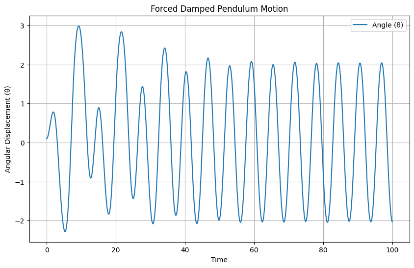

# Problem 2
# Investigating the Dynamics of a Forced Damped Pendulum

The forced damped pendulum is a captivating example of a physical system with intricate behavior resulting from the interplay of damping, restoring forces, and external driving forces. By introducing both damping and external periodic forcing, the system demonstrates a transition from simple harmonic motion to a rich spectrum of dynamics, including resonance, chaos, and quasiperiodic behavior. These phenomena serve as a foundation for understanding complex real-world systems, such as driven oscillators, climate systems, and mechanical structures under periodic stress.

Adding forcing introduces new parameters, such as the amplitude and frequency of the external force, which significantly affect the pendulum's behavior. By systematically varying these parameters, a diverse class of solutions can be observed, including synchronized oscillations, chaotic motion, and resonance phenomena. These behaviors not only highlight fundamental physics principles but also provide insights into engineering applications such as energy harvesting, vibration isolation, and mechanical resonance.

## 1. Theoretical Foundation

### Equation of Motion

The equation for a forced damped pendulum is:

\[
\frac{d^2\theta}{dt^2} + \beta \frac{d\theta}{dt} + \omega_0^2 \sin\theta = A \cos(\omega t)
\]

Where:
- \(\theta\): Angular displacement
- \(\beta\): Damping coefficient
- \(\omega_0\): Natural frequency (\(\sqrt{g/L}\))
- \(A\): Driving amplitude
- \(\omega\): Driving frequency

### Small-Angle Approximation

For small \(\theta\), we approximate \(\sin(\theta) \approx \theta\), so the equation becomes:

\[
\frac{d^2\theta}{dt^2} + \beta \frac{d\theta}{dt} + \omega_0^2 \theta = A \cos(\omega t)
\]

This is a linear, second-order nonhomogeneous differential equation.

#### Solution Strategy:
1. **Homogeneous Solution**: Describes damped free oscillations.
2. **Particular Solution**: Describes steady-state response due to the driving force.

### Resonance Behavior

Maximal amplitude occurs when the driving frequency matches the damped natural frequency:

\[
\omega_{\text{res}} = \sqrt{\omega_0^2 - \frac{\beta^2}{2}}
\]

At resonance, the pendulum can absorb energy efficiently, potentially leading to large amplitudes unless limited by nonlinearity or damping.

---

## 2. Analysis of Dynamics

In this section, we explore how the parameters:
- **Damping coefficient (\(\beta\))**
- **Driving amplitude (A)**
- **Driving frequency (\(\omega\))**

affect the system's behavior. We will see:
- **Periodic motion**
- **Quasiperiodic oscillations**
- **Chaos** (sensitive dependence on initial conditions)

---

## 3. Practical Applications

The forced damped pendulum model applies to several real-world scenarios, including:

- **Energy Harvesters**: Where ambient vibrations drive oscillations for power generation.
- **Suspension Bridges**: Wind forcing can lead to resonance and even catastrophic failure.
- **Driven RLC Circuits**: Analogous differential equations govern current and voltage.

---

## 4. Implementation – Python Code & Simulations

The following Python code simulates the motion of the forced damped pendulum.

### Python Code:

```python
import numpy as np
import matplotlib.pyplot as plt
from scipy.integrate import solve_ivp

# Parameters
beta = 0.5         # damping coefficient
omega_0 = 2.0      # natural frequency
A = 1.2            # driving amplitude
omega = 1.5        # driving frequency

# Time domain
t_span = (0, 50)
t_eval = np.linspace(*t_span, 5000)

# Differential equations
def pendulum(t, y):
    theta, omega_theta = y
    dtheta_dt = omega_theta
    domega_dt = -beta * omega_theta - omega_0**2 * np.sin(theta) + A * np.cos(omega * t)
    return [dtheta_dt, domega_dt]

# Initial conditions: [theta, dtheta/dt]
y0 = [0.1, 0.0]

# Solve
sol = solve_ivp(pendulum, t_span, y0, t_eval=t_eval)

# Plot
plt.figure(figsize=(10, 5))
plt.plot(sol.t, sol.y[0], label='Theta(t)')
plt.title("Forced Damped Pendulum Motion")
plt.xlabel('Time')
plt.ylabel('Angular Displacement (θ)')
plt.grid()
plt.legend()
plt.show()
```



## 5. Observing Behavior
Adjust γ to see how damping affects the motion.

Change A or Ω to observe resonance or transitions to more complex behaviors.

The plot shows angular displacement θ over time.

## 6. Additional Insights
Resonance: Ω ≈ ω₀ → Large amplitude (maximum energy transfer).

Chaos: With higher driving amplitudes or frequencies, the system can exhibit chaotic behavior.

Phase Space: You can visualize the phase portrait by plotting theta vs. omega.

Poincaré Sections and bifurcation diagrams are useful for studying chaotic transitions.

## 7. Conclusion
This simulation demonstrates the dynamic behavior of a forced damped pendulum and is a useful model for studying oscillatory systems in physics and engineering. Extensions include nonlinear damping, random forces, or real-world analogs like RLC circuits and mechanical oscillators.

### Source link
[Colab](https://colab.research.google.com/drive/1Do5EqLaEbj_MFiJXgeBtygSp9FU2I3ni?usp=sharing)
